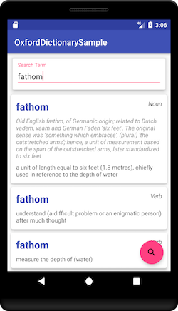

# Oxford Dictionary Sample


## Tools Used
* Android Studio
* Swagger Codegen

## Libraries Used
* Retrofit (http://square.github.io/retrofit/)
* RxJava (https://github.com/ReactiveX/RxJava)
* Renderers (https://github.com/pedrovgs/Renderers)

## Useful Reading
This sample makes use of code generated from the [Oxford Dictionary API Swagger](https://developer.oxforddictionaries.com/documentation) documentation - take a look at https://github.com/psh/oxford-dictionary-api-code-gen for the steps to generate clients in a variety of other languages.

## API Calls
Retrofit REST calls to the Oxford Dictionary API look like you are making a simple method call, for instance
```java
entriesApi.getDictionaryEntries("en", searchTerm, BuildConfig.APP_ID, BuildConfig.APP_KEY);
```

RxJava makes it a breeze to process the highly nested data structure that is returned from the service call
```java
entriesApi.getDictionaryEntries("en", searchTerm, BuildConfig.APP_ID, BuildConfig.APP_KEY)
    .doOnSubscribe(d -> hideKeyboard())
    .flatMap(re -> Observable.fromIterable(re.getResults()))
    .flatMap(he -> Observable.fromIterable(he.getLexicalEntries()))
    .flatMap(le -> Observable.fromIterable(le.getEntries()).map(e -> new CategorizedEntry(searchTerm, le.getLexicalCategory(), e)))
    .flatMap(ce -> Observable.fromIterable(ce.entry.getSenses()).map(s -> new Definition(ce.category, ce.word, ce.entry, s)))
    .toList()
    .observeOn(AndroidSchedulers.mainThread())
    .map(this::createAdapter)
    .subscribe(this::updateRecyclerView);
```
There are a number of points to note:
1. The ```Observable``` chain doesnt execute until a call is made to subscribe().  The ```doOnSubscribe()``` lambda is therefore calls immediately before the service call kicks off.
2. The Retrofit interface was configured to automatically run on a background thread, so we switch back to Android's main thread again for the last couple of steps (by calling ```observeOn()```) before we touch any GUI components.
3. The APP_ID and the APP_KEY are externally defined in the build.gradle file.
4. Walking down the chain of data from ```RetrieveEntry``` to ```HeadwordEntry``` to ```LexicalEntry``` to ```Sense``` would normally result in a deeply nested set of loops.  Transforming that processing into an ```Observable``` chain makes the code much more readable.

## Final Display
Writing the adapter for a ```RecyclerView``` can be a lot of work.  The [Renderers](https://github.com/pedrovgs/Renderers) library allows you to focus on the parts of the process that are most important leaving the library to take care of the rest.  This sample doesnt quite do the library justice as there is only a single type of row in the ```RecyclerView```!
